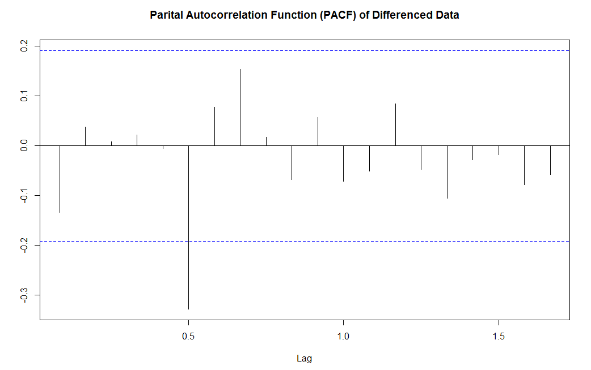

### Tobacco Inventory Analysis - A Time Series Project

**Siyuan Li, PSTAT 174 - Time Series, UCSB**

**Instructor: Raya E. Feldman**

***

#### 1 Overview

##### 1.1 Introduction to the data

Smoking is one of the most important consumptions in the modern society. People are paying more and more attention to the harmful effects of smoking. It is interesting to investigate how people’s raising awareness has affected the tobacco producing industry. However, the financial crisis happened during the 4thquarter of 2008 has brought a lot of changes to many industries. Thus I will belooking at the changes brought to the tobacco production industry. The data Iam looking at is the tobacco manufacturer’s total inventory from January 2000 to October 2013, but for comparison purpose, I excluded November 2008 to October 2013. I will address this excluded part of data in the conclusion section. The inventory of goods is in currency unit which indicated how much value of goods the manufacturers has in stock in the market. It not only means the value of the good but also the amounts of good manufacturers have.

The data is found from “datamarket.com” and is provided by Federal Reserve Bank of St. Louis.

##### 1.2 Introduction to the project

For the project, I analyzed the data as a time series. Using the materials I learned from the PSTAT 174 course, I have conducted a series of calculations based on the data. The purpose of these calculations was to estimate a time series model to fit the data. With the estimated model, I could then predict future changes. I compared the prediction with the real data, which showed that although my forecast is accurate due to unknown factors in the market, the real data still fell inside the confidence interval which made my forecasting acceptable. 

All the calculations, computations and graphing are done using R programming language. 

#### 2 Data Analysis

##### 2.1 Spectating Original Data

Let’s first look at my original data:

We can conclude the following:

1. The data has a decreasing trend.
2. The data has no visible seasonal trend. As a matter of fact, the data I choseis already seasonally adjusted by the source.
3. The variance between entries some how similar, but I am not sure to say if thevariance is stable.

These findings suggests:

1. Differencing the data is needed to achieve a stationary time series process.
2. There is no precise indication whether to difference the data according to someperiod.
3. Certain transformation has to be done to the data to stabilize the variancealthough the result may not be significant.

 Some important values: for original data: Mean: 4733.019, Variance: 344523.4 

##### 2.2 Data Transformation

Based on the finding from the previous part, I was able to do some calculations.
First, I chose to calculate the power coefficient () for power transformation. This process was done in the R programming interface.

This gave a graph of the log-Likelihood function respect to power coefficient :

Using the following code, I obtained the preferred power coefficient :

This result of power coefficient suggests that I could either perform standard power transformation using the coefficient, or keep using the original data. Note that the function to perform power transformation is:

With  = 1.070707, the transformation actually made the variance larger. So I chose to keep using the original data.

Now it remains to difference the data. First, I chose to difference the data at lag 1:

By adding the trend line and mean line to the graph, we can clearly see that the data is now differenced to stationary.

But to be certain, I tried to difference the data one more time. It turned out that the variance increased by doing so, I kept the data difference at lag 1.

##### 2.3 Autocorrelation and Partial Autocorrelation Functions

Autocorrelation functions (ACF) and partial autocorrelation functions (PACF) are mathematical tools for finding certain pattern between observations. They are functions of the time lag between them. ACF and PACF are very helpful functions in estimating a model to fit to the data. The graph of ACF and PACF of my differenced data are as follow:

The first thing I noticed was the decimal X-axis. I consulted this matter with my TA Yuqi Chen, who told me that decimal lag happens when R computes time series and I can simply ignore it. 

By looking at the graph, I suspected that the model can be ARMA(6,6). So I ran an AR test with method of Maximum Likelihood to see whether my suspicion on AR parameters was correct.

It confirmed my guess so I continued on to estimate the number of moving average coefficients.

##### 2.4 Model Fitting

I constructed a "for-loop" to estimate the number of coefficients using Akaike Information Criterion (AIC), more specifically, AICc, the small-sample-size corrected version of AIC. From the result, I found the preferable number of coefficients based on the smallest value of AICc. The best choice is ARIMA(6,1,5). Then I fit ARIMA(6,1,5) to the data to find out the possible coefficients. The result is shown as follow:

Since the previous estimation showed that the differenced data has the behavior of an ARIMA(6,1,5) model, the original AR(6) approach was not appropriate. Although the ARIMA(6,1,5) approximation showed some relatively high standard error, I chose to use the automatically estimated coefficients. Then my best estimated model is:

Then I did standard diagnostic checking on the fitted model residuals. The result is as follow:

It showed that Box-Pierce test, Box-Ljung test, McLeod-Li test all passed with a high p-value, but the Shapiro-Wilk normality test did not pass. It suggests that our data is not normal. I consulted this matter with our TA Yuqi Chen and she suggested that most of our real life data cannot pass normality test because there are too many factors to be considered into the change of data. I agreed with her and I immediately thought of the stock market. Considering the purpose of doing this whole forecasting, my goal was to compare the prediction with unpredictable change, I take the risk of using a data which is not normal.

Still, I have to test for other estimated models I made to find the optimal one.

For ARIMA(6,1,1):

The model is:

The result of the diagnostic checking for residuals is:

The Shapiro-Wilk normality test still did not pass.

For ARIMA(6,1,6):

The model is:

The result of diagnostic checking for residual is:

The Shapiro-Wilk normality test still did not pass. So based on optimal AICc value, I chose to use ARIMA(6,1,5) as the model for my differenced data. I kept the middle order 1 because I differenced the original data once to get a stationary time series.

I also did causality and invertability test to my final model. The results are shown as follow:

These two graph shows that the AR part of my data did not pass the causality and invertability test. This is probably because of the standard error of the ARIMA function generated. I also tried to do this test to the other models I generated; they caused more problems than my best choice.

So the final model is:

#### 3 Forecasting

#### 4 Conclusion

#### 5 Reference

#### Appendix

